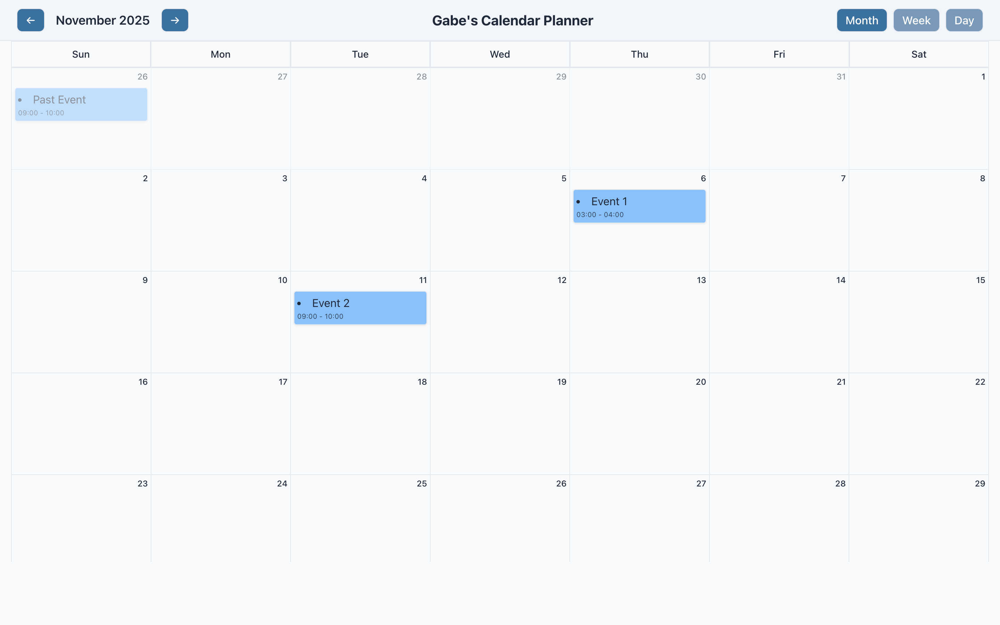
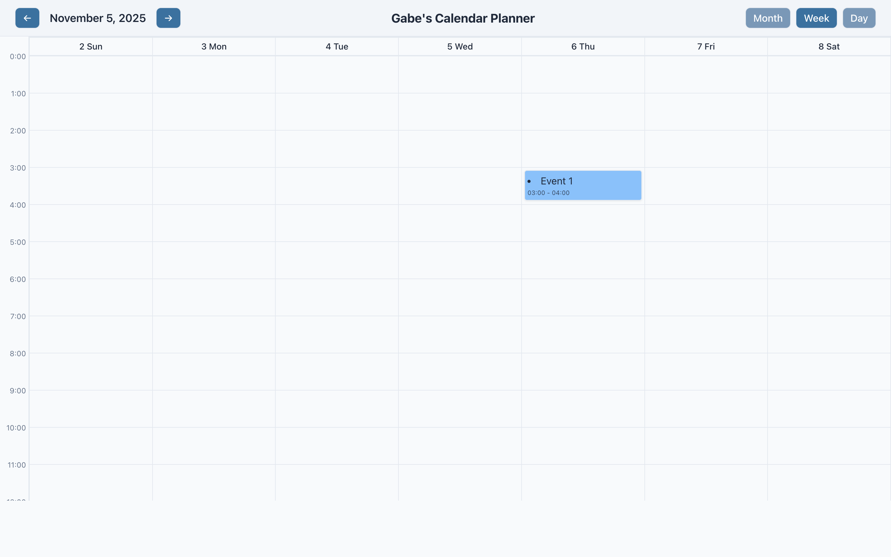
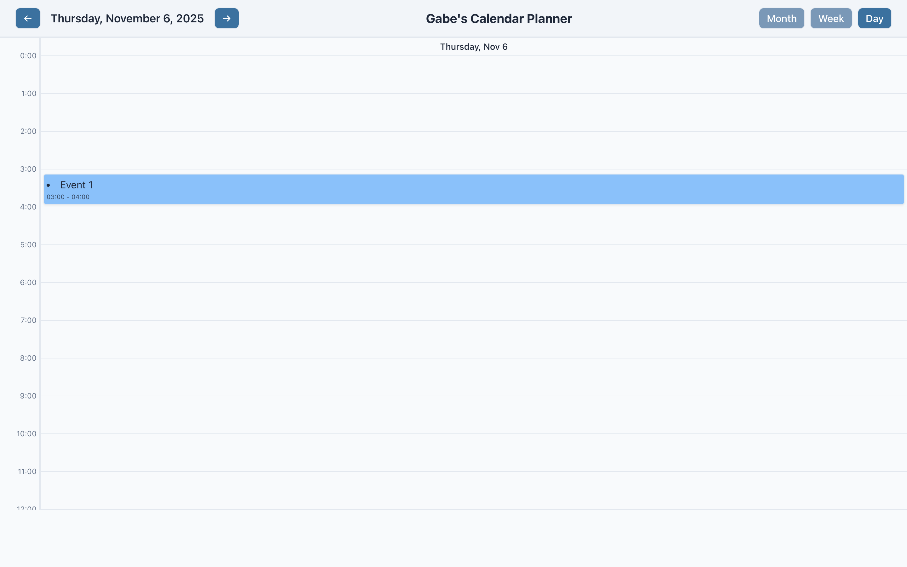

## Instructions

```bash
# Clone repo
git clone https://github.com/Gabe-S5/calendarProject.git
cd calendarProject

# Install dependencies
npm install

# Run the app
npm run dev
```

## Screenshots

### Monthly View


### Weekly View


### Daily View


## Features
- Create, Edit, Delete events with a title, description, and a start/end time.
- Move events between dates by dragging and dropping the event card
- Times are sensitive to your current timezone. Changing timezones will change times to its correct values

## To Do's
- Stacking events on the same hour will not correctly appear in the Week/Day Views
- All events are only stored in localStorage -- can implement a backend/database server
- Add a year view?
- Add shortcuts to go to next month/week/day
  